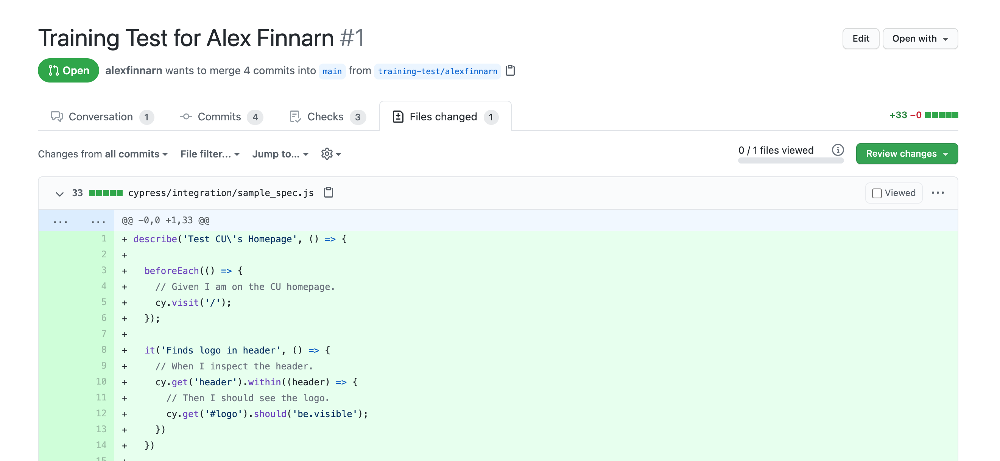
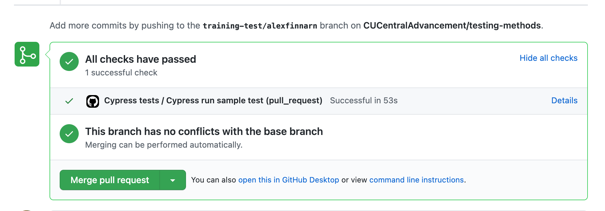

# Cypress Training

[<-- Home](https://github.com/CUCentralAdvancement/testing-methods)

The goal of this document is for you to get familiarized with the Cypress testing platform through examples covering most
of the testing needs you'll encounter.

You'll learn:
- How to setup your computer with the example code
- How to run a Cypress test via the command line and Cypress IDE
- How to write a Cypress test in a text editor or IDE
- Where to find code snippets to help you write tests
- Where to go to gain more Cypress knowledge

## Pre-requisites:

To complete this training, you need to already have a GitHub issue assigned to you from a testing mentor. If you do not have
a relevant issue already assigned, please contact the Central Advancement Testing Czar to being the process.

Here is a sample issue you can look at to help orient you on the whole process and feedback: https://github.com/CUCentralAdvancement/github-docs/issues/12

Each step might also have some pre-requisites to it, so watch out for those items and make sure to complete them before reading the
step.

## Setup Your Computer With Example Code

> **Pre-req:** Install git, [need link to install on PC](#), on your computer.

To inspect and run example Cypress tests, you'll need to clone down this repository using the Git version control system.

```bash
# Choose a directory to install. Example here is MacOS default `/Users/[username]/Downloads` directory.
cd ~/Downloads

# Clone down the git repository into the `/Users/[username]/Downloads/testing-methods` directory.
git clone git@github.com:CUCentralAdvancement/testing-methods.git

# Switch to project directory.
cd testing-methods
```

## Using Cypress IDE and Test Runner

> **Pre-req:** Install node/npm, https://nodejs.org/en/ on your computer.

One of the best features of Cypress is its great documentation. They tell you how to install Cypress, but lucky for you, this repository
already has Cypress included. All you have to do is run one command from your terminal.

```bash
# Install all dependencies into /node_modules directory.
npm install

# Open Cypress IDE for the first time.
npm run cy:open
```

Now, you have all the dependencies needed for running tests as well as the Cypress IDE open. In the IDE, you'll be able to run any of the example
tests you are curious about to see how they work. If you want more details on the IDE and how to use it, please read: https://docs.cypress.io/guides/core-concepts/test-runner.html

## Writing a Cypress Test


```js
// Sample test code...
describe('My First Test', () => {
  it('Does not do much!', () => {
    expect(true).to.equal(true)
  })
})
```

In order to write your first test from scratch after browsing a few examples, please follow these steps: 
- Complete the Cypress training guide: https://docs.cypress.io/guides/getting-started/writing-your-first-test.html.
- Spend five-minutes checking out the Cypress list of available commands: https://docs.cypress.io/api/commands/dblclick.html
- Add another test for something on the https://www.cu.edu website. Try to use some of the commands you found on the previous step. You can view 
a sample test in the example pull request here: https://github.com/CUCentralAdvancement/testing-methods/pull/1/files
- Make a pull request to this repository so that you can see how Github Actions will run the test in 
a continuous integration environment. You can look at this pull request to see a sample test run: https://github.com/CUCentralAdvancement/testing-methods/runs/1597663400?check_suite_focus=true#step:3:1



Your pull request will trigger a test run that uses GitHub Actions to install Cypress and run your sample test in the "cloud".



Once the pull request checkmark is green, you can go back to the training issue and mark "Clone down sample project and run example 
tests" as completed. Your mentor will go check the pull request and close it later.

## Additional Examples

Developers at CU Central Advancement have gathered together several Cypress testing commands into code block snippets that you can copy, paste, 
and modify for your own needs. Snippets are grouped by the "application under test".

- Giving Site - Drupal 7 and custom templates
- Salesforce Ascend - The Advancement replacement for AI.

## More Cypress Information

Cypress has tons of great docs on their documentation website...here are some...

- dd - 
- dd - 
- dd - 
